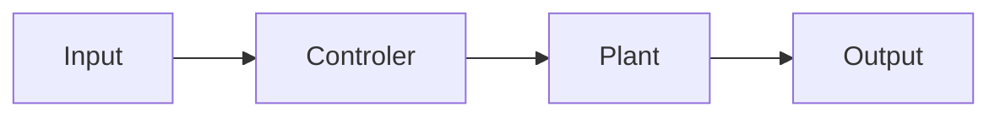
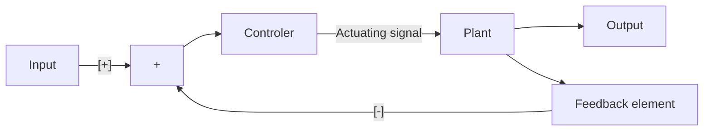
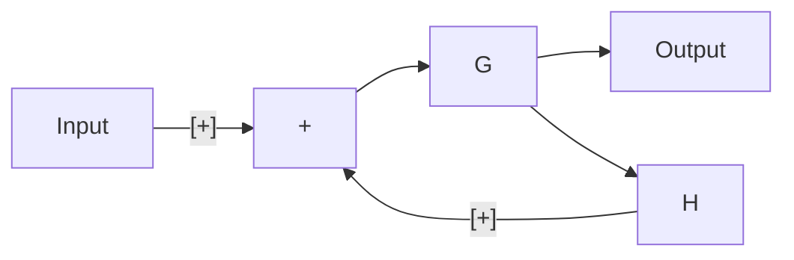
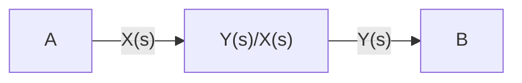
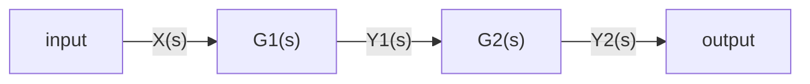
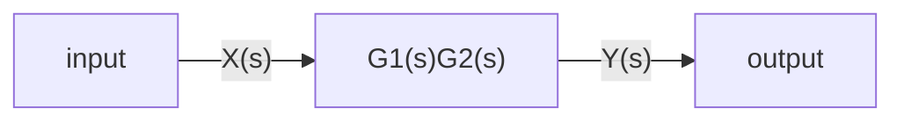
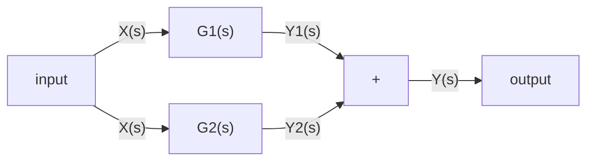
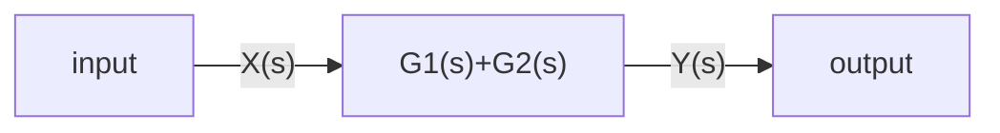
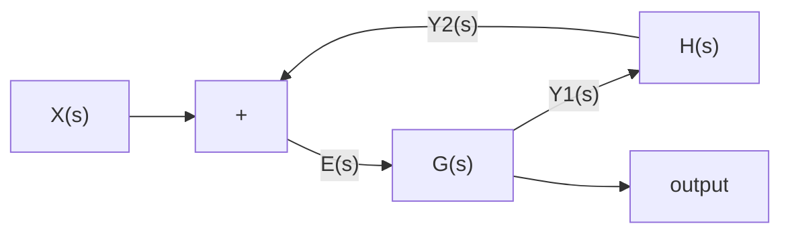

# Control system

## What are control systems?

Control systems are systems that control other systems. They are used to control the behavior of a system. They are used in many different fields, such as robotics, aerospace, and automotive.

## General representation of a control system

### Open loop control system

An open loop control system is a control system that does not have any feedback. It is represented by the following diagram:

⚠️ **Warning**: Open loop should not be used because it does not have any feedback

### Closed loop control system

A closed loop control system is a control system that has feedback. It is represented by the following diagram:

## Open loop control system vs closed loop control system

| Open loop control system | Closed loop control system |
| ------------------------ | -------------------------- |
| No feedback              | Has feedback               |
| No stability             | Stable                     |
| No accuracy              | Accurate                   |

## Types of feedbacks

### Positive feedback

Positive feedback is a feedback that increases the output of the system. It is represented by the following diagram:

Mathematically, it is represented by the following transfer function:

$$
T(s) = \frac{G(s)}{1 - G(s)H(s)}
$$

- T : is the transfer function or overall gain of negative feedback control system

- G : is the open loop gain, which is function of frequency.

- H : is the gain of feedback path, which is function of frequency.

### Negative feedback

Negative feedback is a feedback that decreases the output of the system. It is represented by the following diagram:

Mathematically, it is represented by the following transfer function:

$$
T(s) = \frac{G(s)}{1 + G(s)H(s)}
$$

## Transfer function

The transfer function is the ratio between the output and the input of a system. It is represented by the following equation:

$$
T(s) = \frac{Y(s)}{X(s)}
$$

## Block diagram

In control systems, a transfer function is represented by a block diagram

As explained in the previous section, a transfer function is the ratio between the output and the input of a system

$$G(s)=\frac{Y(s)}{X(s)}$$

therefore,

$$Y(s)=G(s)X(s)$$

This is the representation of a transfer function of an **open loop control system**

## From diagram to transfer function

### Series connection

A series connection is a connection between two systems in which the output of the first system is the input of the second system

Now, let's start from the end of the chain and work our way back

$$Y2(s)=G_2(s)Y_1(s)$$

$$Y1(s)=G_1(s)X(s)$$

$$\Rightarrow Y2(s)=G2(s)G1(s)X(s)$$

We can simplify these 2 blocks into one block

### Parallel connection

A parallel connection is a connection between two systems in which the output of the first system and the output of the second system are added together

$$Y(s)=Y_1(s)+Y_2(s)$$

$$\Leftrightarrow Y(s)=G_1(s)X(s)+G_2(s)X(s)$$

$$\Leftrightarrow Y(s)=(G_1(s)+G_2(s))X(s)$$

We can simplify these 2 blocks into one block

### So, how do we get the transfer function for the feedback loop ?

In a feedback loop, we are looking to correct the error by computing the difference between the desired output and the actual output

E(s) is the error

To compute the error, we need to subtract the actual output from the desired output

$$E(s)=X(s)-Y_2(s)$$

$$\Leftrightarrow E(s)=X(s)-Y_1(s)H(s)$$

We can continue the substitution

$$E(s)=X(s)-E(s)G(s)H(s)$$

We factorize the E(s)

$$E(s)(1-G(s)H(s))=X(s)$$

$$\Leftrightarrow E(s)=\frac{X(s)}{1+G(s)H(s)}$$

We know that $Y(s)=G(s)E(s)$
so we substitute in in the equation

$$\frac{Y(s)}{G(s)}=\frac{X(s)}{1+G(s)H(s)}$$

We rearrange the equation

$$\frac{Y(s)}{X(s)}=\frac{G(s)}{1+G(s)H(s)}$$

We now have the transfer function for the feedback loop

